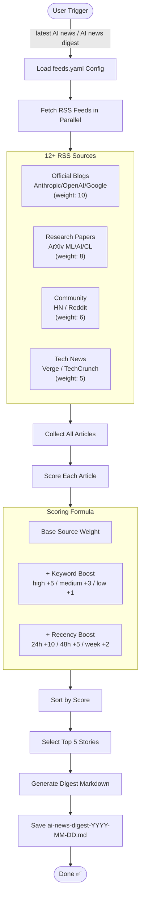

# AI News Digest Plugin

Automatically aggregates latest AI news from multiple sources and generates a curated Top digest on-demand.

> **Note:** This skill is bilingual and defaults to **Korean** for its interactive prompts and confirmation messages (the upstream is Korean-first). English trigger phrases work too; output language follows the user's lead.

## Process Flow



## Features

- **Multi-Source Aggregation**: Fetches from 12+ RSS feeds (Anthropic, OpenAI, Google, ArXiv, Hacker News, Reddit, etc.)
- **Smart Scoring**: Ranks news by relevance, recency, and source authority
- **Top 5 Curation**: Automatically selects the most important stories
- **Configurable Sources**: Easily add/remove RSS feeds via YAML config
- **Fast Execution**: Parallel fetching with caching
- **Markdown Output**: Clean, readable digest documents

## Installation

### From Marketplace (Recommended)

```bash
/plugin marketplace add JayKim88/claude-ai-engineering
/plugin install ai-news-digest
```

### Via npx

```bash
npx github:JayKim88/claude-ai-engineering ai-news-digest
```

### Local Development

```bash
cd ~/Documents/Projects/claude-ai-engineering
npm run link
```

## Requirements

- Claude Code CLI
- Python 3.7+
- `feedparser` and `pyyaml` packages (auto-installed)

```bash
pip3 install feedparser pyyaml
```

## Usage

### Trigger Phrases

**English:**
- "latest AI news"
- "AI news digest"
- "what's new in AI"
- "fetch AI news"

**Korean:**
- "최신 AI 뉴스"
- "AI 뉴스 정리"
- "AI 소식"

### Example

```
User: "최신 AI 뉴스 가져와줘"

Claude: Fetching latest AI news from the past 7 days...

[15 seconds later]

✅ AI News Digest saved to: ./ai-news-digest-2026-02-03.md

📊 Summary:
- 12 sources checked
- 47 articles found
- Top 5 selected

🔥 Top Stories:
1. Claude 3.5 Opus Released - Anthropic Blog (score: 45)
2. GPT-5 Training Details - OpenAI Blog (score: 42)
3. Breakthrough in Multimodal Reasoning - ArXiv (score: 38)
4. New Open-Source LLM Benchmarks - Hacker News (score: 35)
5. Fine-tuning Best Practices - Reddit (score: 32)

Want me to analyze any of these in detail?
```

## RSS Feed Sources

### Official Blogs (High Priority)
- Anthropic Blog
- OpenAI Blog
- Google AI Blog
- DeepMind Blog

### Research Papers (High Priority)
- ArXiv Machine Learning (cs.LG)
- ArXiv Artificial Intelligence (cs.AI)
- ArXiv Computation and Language (cs.CL)

### Community (Medium Priority)
- Hacker News (AI filter)
- Reddit r/MachineLearning
- Reddit r/LocalLLaMA

### Tech News (Medium Priority)
- The Verge - AI
- TechCrunch - AI

## Scoring System

Each news item gets a score based on:

1. **Source Weight**:
   - Official blogs: 10 points
   - Research papers: 8 points
   - Community: 6 points
   - Tech news: 5 points

2. **Keyword Boost**:
   - High priority keywords (+5): GPT-5, Claude 4, Gemini, breakthrough, SOTA
   - Medium priority (+3): LLM, transformer, fine-tuning, RLHF
   - Low priority (+1): AI, machine learning, deep learning

3. **Recency Boost**:
   - Last 24 hours: +10
   - Last 48 hours: +5
   - Last week: +2

**Final Score** = Base Weight + Keyword Boost + Recency Boost

## Configuration

Edit `config/feeds.yaml` to customize sources:

```yaml
feeds:
  official_blogs:
    - name: "Your Custom Blog"
      url: "https://your-blog.com/rss"
      weight: 10
      category: "official"
```

Edit `scoring` section to adjust keyword priorities:

```yaml
scoring:
  keyword_boost:
    high_priority:
      - "your_important_term"
```

## Output Format

Generated digest includes:

```markdown
# AI News Digest - Last 7 Days

## Top 5 AI News

### 1. [Title] 🔥
**Source**: ... | **Published**: ... | **Score**: ...

[Summary]

**Key Points**:
- ...

**Why It Matters**: ...

**Read More**: [Link]
```

## Advanced Usage

### Filter by Time Range

```
"AI news from last 24 hours"
"지난 48시간 AI 소식"
```

### Filter by Category

```
"Latest AI research papers only"
"Official blog posts only"
```

### Custom Keywords

```
"Latest AI news, focus on 'agents' and 'reasoning'"
```

## Tips

1. **Daily Routine**: Run every morning to catch up on overnight news
2. **Filter Noise**: Use "official + research only" for high-quality content
3. **Trend Detection**: Run weekly to identify emerging topics
4. **Deep dives**: For any Top item, follow its link and analyze the page directly
5. **Save for Later**: All links preserved for future reference

## Troubleshooting

**Issue**: "Python dependencies missing"
- **Solution**: Run `pip3 install feedparser pyyaml`

**Issue**: "No results found"
- **Solution**: Expand time range ("last 14 days") or check internet connection

**Issue**: "RSS feed timeout"
- **Solution**: Plugin automatically skips failed feeds and continues

**Issue**: "ModuleNotFoundError: feedparser"
- **Solution**: Ensure Python 3 is installed and run `pip3 install feedparser pyyaml`

## Integration

### Deep-dive on a Top item

```
1. "Get latest AI news"
2. "Analyze the #1 article in detail"
   → Follow the article link and analyze the page directly
```

## Future Enhancements

- [ ] Email delivery integration
- [ ] Slack/Discord webhooks
- [ ] Scheduled daily/weekly digests (cron)
- [ ] Trending topics detection
- [ ] Sentiment analysis
- [ ] Visual charts and graphs
- [ ] Export to Notion/Obsidian
- [ ] Personalized feeds based on interests

## Performance

Feeds are fetched in parallel and cached (default 30-minute TTL), so a first run
completes in a few seconds and cached runs return almost instantly. Scoring and
deduplication add negligible time.

## Contributing

Found a bug or have a feature request? Open an issue at:
https://github.com/JayKim88/claude-ai-engineering/issues

## License

MIT License - See LICENSE file for details

## Author

**Jay Kim**
- GitHub: [@JayKim88](https://github.com/JayKim88)

---

**Inspired by**: [QuantumExecBrief](https://timothyjohnsonsci.com/blogs/2026-01-25-building-quantumnews-with-claude-code/) and existing RSS aggregators in the Claude Code ecosystem.
