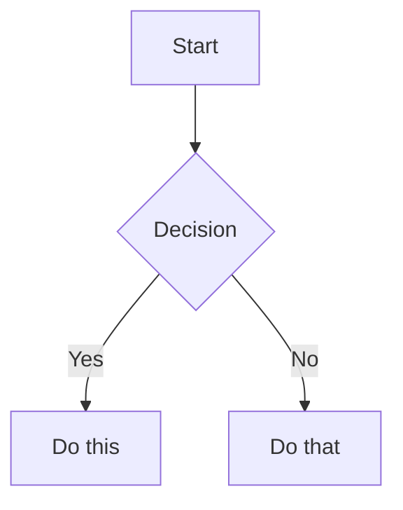

# Obsidian Flavored Markdown

Obsidian extends standard Markdown with wikilinks, embeds, callouts, properties/frontmatter, and other syntax. This skill covers all Obsidian-specific extensions on top of standard CommonMark/GFM.

For complete reference details, read:
- `references/callouts.md` — all callout types, nesting, and folding
- `references/embeds.md` — note, image, PDF, audio, and video embed syntax
- `references/properties.md` — frontmatter property types and built-in properties

---

## Properties (Frontmatter)

YAML frontmatter appears at the very top of a note, delimited by `---`:

```yaml
---
title: My Note Title
tags:
  - programming/python
  - status/draft
status: draft
rating: 4.5
date: 2024-01-15
done: false
due: 2024-01-15T14:30:00
aliases:
  - Alternative Name
cssclasses:
  - my-custom-class
---
```

**Property types**: `text`, `number`, `checkbox` (true/false), `date` (YYYY-MM-DD), `date & time` (YYYY-MM-DDTHH:MM:SS), `list`, `links`

**Built-in properties**:
- `tags` — searchable tags, appear in graph view
- `aliases` — alternative names for wikilink suggestions
- `cssclasses` — CSS classes applied in reading and editing modes

See `references/properties.md` for full type reference.

---

## Internal Links (Wikilinks)

Wikilinks are the core linking mechanism. They automatically update when notes are renamed.

```
[[Note Name]]                    — link to a note
[[Note Name|Display Text]]       — link with custom display text
[[Note Name#Heading]]            — link to a specific heading
[[Note Name#^block-id]]          — link to a specific block
[[#Heading]]                     — link to heading in the same note
[[#^block-id]]                   — link to block in the same note
```

**Use wikilinks for all internal vault links.** Use standard Markdown links `[text](url)` only for external URLs.

**Pipe syntax for mid-sentence lowercase.** Use `[[Canonical Name|display text]]` when Title Case would look jarring mid-sentence for non-proper-noun concepts. At sentence start or for proper nouns, the bare wikilink is fine.

```
# BAD — Title Case mid-sentence
applies [[Gradient Descent]] to minimize loss

# GOOD — pipe for lowercase display
applies [[Gradient Descent|gradient descent]] to minimize loss

# FINE — sentence start or proper noun
[[Gradient Descent]] is an optimization algorithm...
built on [[Apache Kafka]] for streaming
```

### Block IDs

To create a linkable block, add `^block-id` at the end of a paragraph, list item, or table row:

```
This is a paragraph that can be referenced. ^my-paragraph

- List item that can be referenced ^my-item
```

Block IDs contain only letters, numbers, and hyphens. Then reference it from anywhere:

```
See [[Note Name#^my-paragraph]] for context.
```

---

## Embeds

Embeds display content inline using `![[...]]` syntax. See `references/embeds.md` for full details.

```
![[Note Name]]                   — embed entire note
![[Note Name#Heading]]           — embed from heading to next heading
![[Note Name#^block-id]]         — embed a specific block

![[image.png]]                   — embed image at full size
![[image.png|300]]               — embed image with width 300px
![[image.png|300x200]]           — embed image with width and height

![[document.pdf]]                — embed PDF viewer
![[document.pdf#page=3]]         — embed PDF opened at page 3
![[document.pdf#height=400]]     — embed PDF with specific height

![[audio.mp3]]                   — embed audio player
![[video.mp4]]                   — embed video player
```

External images use standard Markdown with optional sizing:
```


```

---

## Callouts

Callouts are styled blockquotes for highlighting information. See `references/callouts.md` for all types.

```
> [!note]
> Default callout with the note type.

> [!tip] Custom Title
> A tip with a custom title.

> [!warning]- Collapsed by default
> This content is hidden until expanded.

> [!info]+
> Expanded by default (explicitly open).
```

Nesting callouts:
```
> [!info] Outer callout
> Outer content.
>
> > [!tip] Inner callout
> > Inner content.
```

The 13 built-in types (as of 2026-05; verify against current Obsidian docs): `note`, `abstract`, `info`, `todo`, `tip`, `success`, `question`, `warning`, `failure`, `danger`, `bug`, `example`, `quote`. Each type has aliases (e.g. `hint` → `tip`, `faq` → `question`).

---

## Tags

Tags can appear inline in note content or in frontmatter:

```
Inline tag: #programming/python

Nested tags use forward slashes: #status/draft #type/concept
```

In frontmatter:
```yaml
tags:
  - programming/python
  - status/draft
```

Tag rules: letters (any language), numbers (not as first char), underscores, hyphens. No spaces.

---

## Comments

Hidden text that is not rendered in Reading view:

```
%%This text is hidden from readers.%%

%%
Multi-line comment
spanning several lines
%%
```

---

## Math (LaTeX)

Inline math uses single dollar signs, display math uses double:

```
Inline: $E = mc^2$

Display:
$$
\int_0^\infty e^{-x^2} dx = \frac{\sqrt{\pi}}{2}
$$
```

Obsidian uses MathJax for rendering (implementation detail — verify against current Obsidian docs, as rendering engine may change).

---

## Mermaid Diagrams

Use fenced code blocks with the `mermaid` language identifier:

````

````

Supported diagram types: `graph`, `flowchart`, `sequenceDiagram`, `classDiagram`, `stateDiagram`, `gantt`, `pie`, `erDiagram`, `journey`, and more (as of 2026-05; verify against current Obsidian/Mermaid docs for the up-to-date list).

---

## Footnotes

Standard footnotes:
```
This sentence has a footnote.[^1]

[^1]: This is the footnote text.
```

Inline footnotes (defined where referenced):
```
This sentence has an inline footnote.^[This is the inline footnote text.]
```

---

## Text Formatting Extensions

Obsidian adds these on top of standard Markdown bold/italic/code:

```
==highlighted text==             — yellow highlight

~~strikethrough~~                — strikethrough text
```

---

## Tasks

Obsidian extends standard Markdown checkboxes with custom statuses:

```
- [ ] Incomplete task
- [x] Completed task
- [/] In progress (rendered differently by many themes)
- [-] Cancelled
- [!] Important
- [?] Question
```

---

## Example Note

```markdown
---
title: Redis Cache Invalidation Strategies
tags:
  - programming/databases
  - status/draft
type: concept
source: https://redis.io/docs/manual/eviction
date: 2024-01-15
---

# Redis Cache Invalidation Strategies

Key approaches for managing stale data in Redis. See also [[Cache Patterns]] and [[Redis Configuration]].

> [!info] Prerequisites
> Familiarity with [[Redis Data Structures]] is assumed.

## Strategies

### TTL-based Expiration

Set an expiry on every key. Simple but imprecise. ^ttl-strategy

$$
\text{miss rate} \approx \frac{\text{TTL variance}}{\text{key lifetime}}
$$

### Event-driven Invalidation

Use [[Redis Pub/Sub]] to broadcast invalidation events. ^event-strategy

## Summary

%%TODO: add benchmark data%%

All three strategies are covered in [[Cache Patterns#^comparison-table]].
```
